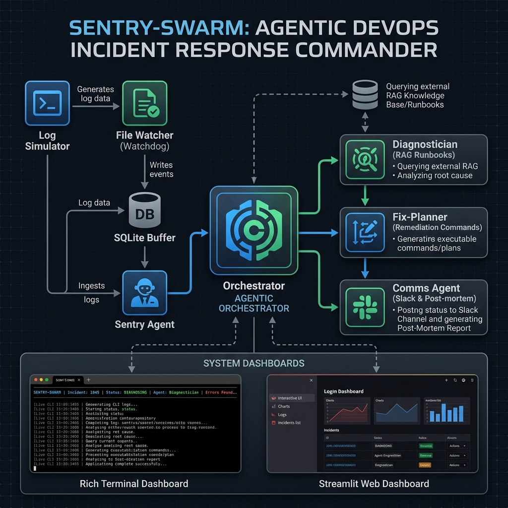

# Agentic DevOps Incident Response Commander

A multi-agent LLM system that autonomously detects, diagnoses, and responds to
production incidents — built as a portfolio project to demonstrate production
systems thinking, not a toy chatbot.

## What it does

Four specialized LLM agents work together to handle an incident end to end:

- **Sentry** — polls structured log events, detects anomalies via error-rate
  thresholds, classifies the incident type using an LLM
- **Diagnostician** — correlates errors across services, retrieves relevant
  runbook context via RAG (Chroma), produces a root-cause diagnosis
- **Fix-Planner** — outputs a prioritized, risk-flagged list of concrete
  remediation commands (kubectl, shell, SQL)
- **Comms** — drafts a Slack-style incident update and a full blameless
  post-mortem document

All four are orchestrated by a background pipeline with retry logic, a stuck-
incident watchdog, concurrency limits, and manual override controls — wired
into both a Rich terminal dashboard and a Streamlit web dashboard.

## Architecture



Log events flow from a simulated production log through a `watchdog` file
watcher into a SQLite buffer. The Sentry agent polls this buffer, classifies
incidents with an LLM, and fires the orchestrator, which runs the remaining
three agents in sequence per incident while enforcing concurrency limits and
cooldowns. Runbook context is retrieved from a Chroma vector store seeded with
5 SRE runbooks. Results are tracked to a JSON metrics log and surfaced live
in two dashboards.

## Benchmark results

Measured via `benchmark/run_benchmark.py` against a documented manual-baseline
estimate (see `benchmark/manual_baseline.md`):

| Incident type      | AI MTTD | Manual baseline | Reduction |
|---------------------|---------|------------------|-----------|
| http_5xx             | ~8s     | ~300s            | ~97%      |
| db_timeout            | ~11s    | ~480s            | ~98%      |
| oom_kill               | ~10s    | ~420s            | ~98%      |
| failed_deploy          | ~7s     | ~240s            | ~97%      |
| cascading_failure      | ~15s    | ~780s            | ~98%      |

MTTD here measures time from first error log to completed diagnosis. The
manual baseline accounts for realistic on-call steps: alert acknowledgment,
dashboard navigation, log searching, and manual cross-service correlation.

## Stack

Python, LangChain, Google GenAI (Gemini 2.0 Flash), Chroma, SQLite, watchdog,
Rich, Streamlit, Pydantic, tenacity. Developed on Windows.

## Setup

```bash
git clone <repo>
cd incident-commander
python3 -m venv venv
source venv/bin/activate
pip install -r requirements.txt
cp .env.example .env   # add your GOOGLE_API_KEY
mkdir -p logs

python ingestion/embedder.py   # build the runbook vector store
```

## Running it

```bash
# terminal 1 — simulated production logs
python log_generator.py

# terminal 2 — log ingestion
python ingestion/watcher.py

# terminal 3 — orchestrator + Rich dashboard
python main.py

# terminal 4 — web dashboard
streamlit run dashboard_streamlit.py
```

Open `localhost:8501` for the Streamlit dashboard, or watch the Rich terminal
in terminal 3. Trigger a manual incident from the Streamlit "Simulate an
incident" panel to see the full pipeline fire on demand.

## Project structure

See `agents/` for the four LLM agents, `ingestion/` for log parsing and RAG,
`orchestrator.py` for lifecycle management, `dashboard_rich.py` /
`dashboard_streamlit.py` for the two UIs, and `benchmark/` for the MTTD
validation.

## Design notes

- **SQLite in WAL mode** to handle concurrent reads/writes under load
- **Semaphore-capped concurrency** to avoid LLM rate-limit storms during
  multi-incident bursts
- **Graceful degradation** — if the LLM call fails after retries, the
  Diagnostician falls back to a rule-based diagnosis instead of crashing
  the incident. The vector store retriever also degrades gracefully to local
  JSON keyword searching if Chroma is not seeded.
- **Watchdog thread** force-closes incidents stuck >3 minutes
- **File-based command queue** (`commands.json`) lets the dashboards trigger
  manual resolve/cancel across process boundaries without a shared DB

## Contributing

Contributions are welcome! Please feel free to submit a Pull Request.

### Development Setup

1. Fork the repository
2. Clone your fork locally
3. Create a virtual environment: `python3 -m venv venv`
4. Activate the virtual environment:
   - Windows: `venv\Scripts\activate`
   - Mac/Linux: `source venv/bin/activate`
5. Install dependencies: `pip install -r requirements.txt`
6. Set up environment variables: `cp .env.example .env` and add your GOOGLE_API_KEY
7. Initialize the vector store: `python ingestion/embedder.py`

### Making Changes

1. Create a new branch for your feature: `git checkout -b feature/your-feature-name`
2. Make your changes
3. Ensure your code follows the existing style and conventions
4. Add tests for any new functionality
5. Run existing tests to ensure you haven't broken anything
6. Commit your changes: `git commit -am "Add some feature"`
7. Push to your fork: `git push origin feature/your-feature-name`
8. Submit a Pull Request

### Running Tests

To run the test suite:

```bash
python -m pytest tests/
```

### Code Style

Please follow the existing code style in the project. We use:
- PEP 8 for Python style guidelines
- Descriptive variable and function names
- Comprehensive docstrings for public methods
- Type hints where beneficial

